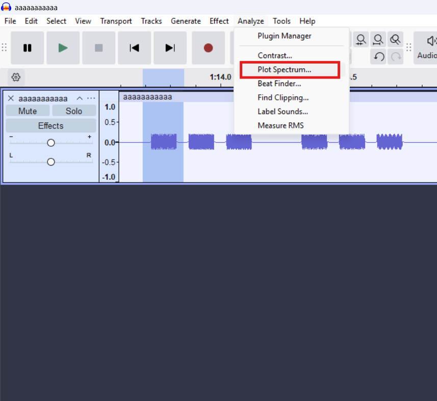
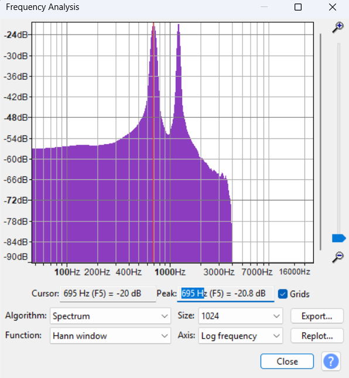
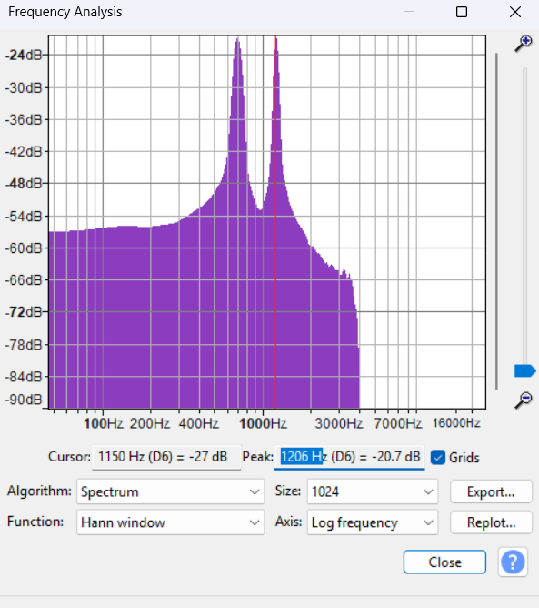
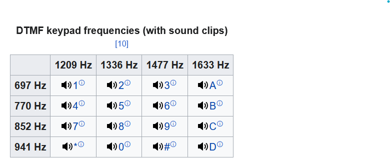

# Alo! Bayrak

 |    |  |
 | ------------- |-------------|
 | Zorluk        | Orta (350 Puan)|
 | Aşama         | Final   |
 | Soru Türü     | Networking |
 | Dosyalar      | ^-^.pcapng |
 | Yazar(lar)    | [Selim](https://github.com/selimgunall) |

## Soru Metni

```
Alo! Bayrak bulma hattı nasıl yardımcı olabilirim.
```

## Çözüm

Bize verilen .pcap dosyası incelediğimizde RTP(voip) paketleri görüyoruz.
<br>
İncelemek için Wireshark->Telephony->RTP->RTP Streams dediğimizde en uzun telefon konuşmasını seçiyoruz. Ardından Play Stream diyoruz ve bizim aradığımız ses dalgaları(waveform) çıkıyor. Ctrl+A yapıp exportluyoruz.
<br>
Elimizdeki .wav dosyasını Audacity ile açıyoruz.
<br>
Bunlar DTMF yani telefonlardaki bip-bip-bip sesi bunlar arka planda bir ses frekansını temsil ediyor örneğin 8 sayısı 852Hz ve 1336Hz temsil ediyor. Tablosunu aşağıya koyuyorum. Burada sayı sayı ilerliyoruz. İlk bip sesini seçip Analyze->Plot Spectrum dediğimizde o ses aralığındaki sesin frekansını detaylı bir şekilde veriyor. İlk bip sesi 696Hz ve 1206Hz peak yapmış yani 1 sayısını temsil ediyor resmi frekanslarla arasında biraz fark olucaktır bu normaldir. Boşluklara dikkat ederek ses kaydı bitene kadar ilerliyoruz.
<br>
Elimizde "104 116 116 112 115 58 47 47 98 105 116 46 108 121 47 98 97 121 114 97 107 115 101 110 100 101" bu bir ascii. Bunu çevirdiğimizde elimize "https://bit.ly/bayraksende" linki geliyor. Açtığımızda bizi bayrakla birlikte çok güzel bir video karşılıyor.







## Flag

```
BayrakBende{😜😜😜}
```
