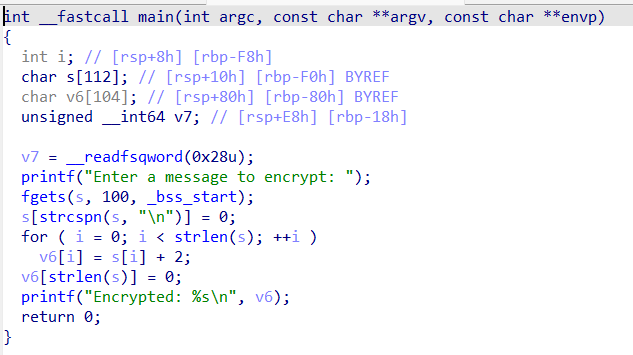
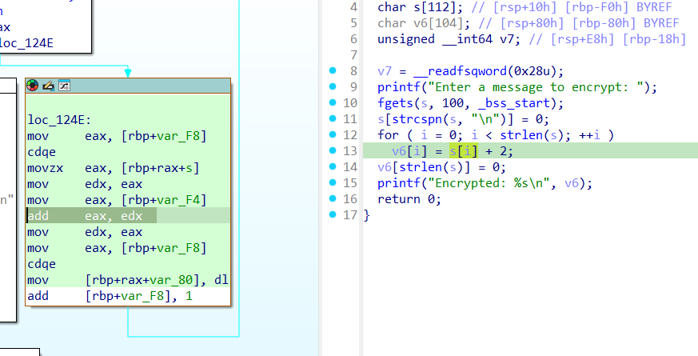
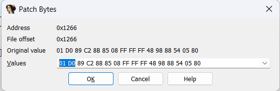
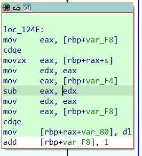

# Fidye
|    |  |
| ------------- |-------------|
| Zorluk        | Kolay (200 Puan)|
| Aşama         | Final    |
| Soru Türü     | Tersine Mühendislik |
| Dosyalar      | ransom |
| Yazar(lar)    | [Kuzey Arda Bulut](https://github.com/kuzeyardabulut) |

## Soru Metni
```
"Yaz stajyerlerimizden birisi sistemlerimize basit bir fidye yazılımı bulaştırmış."

Şifrelenen mesaj: Dc{tcmDgpfg}u6mcncpf3paf2uvwo
```

## Çözüm
Main fonksiyonu decompile edildiğinde girilen karakterin ascii index'inin 2 fazlası çıktı olarak verildiği görülüyor.



Basit bir çözüm olarak ascii index'ini iki azaltıp çözümü gerçekleştiren herhangi bir script yazılabilir. Ama sırf daha eğitici olsun diye bu writeup'ta binary'i patchleyerek bu işlevi yapacağız.



Görüldüğü üzere index'in azaltıldığı instruction "add eax, edx" şeklinde. Bu instruction'u "sub eax, edx" şeklinde değiştirerek çözümü gerçekleştirebiliriz.
Patchlemek için ilgili satırı seçtikten sonra "Edit" -> "Patch program" -> "Change byte" diyerek patch penceresi açılır.



Hex düzeyinde "01 D0" -> "29 D0" şeklinde değiştirilir. 



Görüldüğü üzere instruction değişti.

Şifrelenen mesaj ile program çalıştırılarak flag elde edilir.

## Bayrak
```
BayrakBende{1yi_ki_v4rs1n_3ren!}
```
