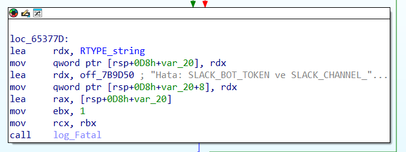
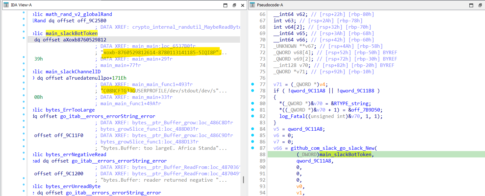
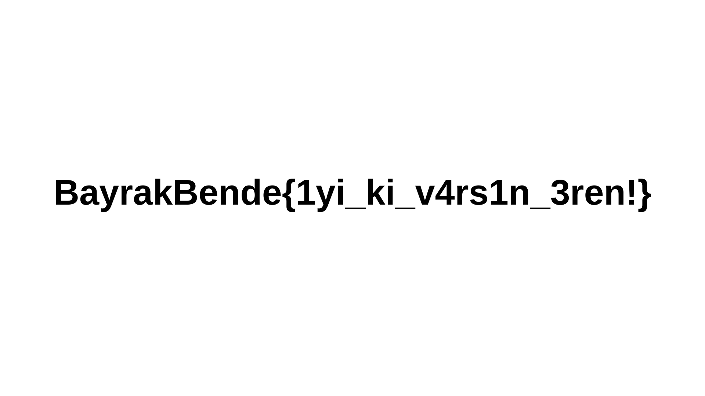

***
**UYARI**: Buradaki hiçbir şeyi kontrolsüz bir ortamda çalıştırmayın! \
**WARNING**: Do not execute anything here in an uncontrolled environment!
***

# Gevşek
|    |  |
| ------------- |-------------|
| Zorluk        | Zor (500 Puan)|
| Aşama         | Final    |
| Soru Türü     | Tersine Mühendislik |
| Dosyalar      | word.exe |
| Yazar(lar)    | [Ömer Faruk Sönmez](https://github.com/omertheroot) |

## Soru Açıklaması
```
Urbatek sunucularında zararlı olduğunu düşündüğümüz bir exe dosyası keşfettik. Henüz tam emin olamasak da, sistemdeki bazı dosyaları bir yere yüklediğini tahmin ediyoruz.
```

## Çözüm
Sorunun açıklamasında da belirtildiği gibi, binary dosyaları karşı bir sunucuya yüklemektedir. Statik olarak analiz ediyoruz:



Bu debug printinden binary'nin dosyaları bir SLACK kanalına yüklediğini tahmin edebiliriz. Daha detaylı inceliyoruz.



Slack handler'ının initalize olduğu yerde bot tokeni ve channel id'yi elde ediyoruz. Bu aşamada opsiyonel olarak wireshark da kullanılabilirdi.

Flag'in slack kanalına yüklenen dosyalardan biri olabileceğini varsayıyoruz. Dolayısıyla Slack API'ı ile bu dosyaları listeleyip indirecek bir script yazıyoruz.

[Slack Script](./cozum.py)

İndirilen dosyaların arasında flag.png olduğunu görüyoruz.



## Bayrak
```
BayrakBende{1yi_ki_v4rs1n_3ren!}
```
