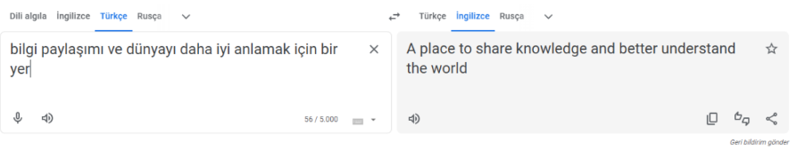

# Manful
 |    |  |
 | ------------- |-------------|
 | Zorluk        | Orta (350 Puan)|
 | Aşama         | Yarı Final   |
 | Soru Türü     | OSINT |
 | Yazar(lar)    | [Mert Demiray](https://github.com/mertdemiray) |
## Soru Metni

```
2004 yılından beri Urbatek firmasında çalışan Türk asıllı siber güvenlik uzmanı Manful
Ironmoon, şirketin yeni güvenlik regülasyonları sebebiyle sosyal medya platformlarındaki
bütün paylaşımlarını silmek zorundadır.

Fakat bilgi paylaşımı ve dünyayı daha iyi anlamak için bir yer'de açtığı bir hesabın şifresini
unutmuştur ve bu hesaptaki paylaşımlarını silememektedir. Bu küçük internet kalıntılarının
arasından bayrağı bulabilicek misin?
```

## Çözüm

"bilgi paylaşımı ve dünyayı daha iyi anlamak için bir yer'de" cümlesinde ‘de’ bağlacı birleşik
yazılması gerekirken kesme işaretiyle ayrılmış. Burada yarışmacıdan özel isim olabileceğine dair bir gönderme vardır.

Manful Ironmoon isminin uydurma ingilizce bir isim olmasından dolayı bu cümleyi ingilizceye çeviriyoruz.


Sonrasında bu cümleyi bir arama motoru yardımıyla internette aratıyoruz.


Gördüğümüz gibi ilk çıkan sonuçlarda hep “Quora” platformunu görüyoruz.
Aynı işlemin tersini Manful Ironmoon ismine uyguluyoruz (Türkçeye çeviriyoruz.)

Karşımıza Mert Demiray veya Yiğit Demiray isimli iki adet hesap çıkıyor.
İkisini de Quara platformunda arattıktan sonra "mert demiray" hesabı dikkatimizi çekiyor.


Bu posttaki büyük harflerden Steganography kelimesi çıkıyor.


Hesabın paylaşmış olduğu bir diğer posttaki fotoğrafa online araçlar veya Zsteg aracıyla incelediğimizde flag karşımıza çıkıyor.

## İpucu

```
1. Kırmızı "Q" logolu bir platform 
```

## Flag

```
BayrakBende{Quoala}
```
