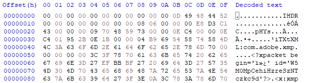
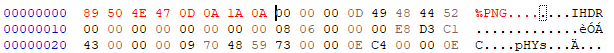
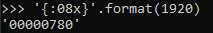
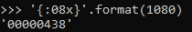
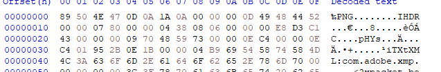
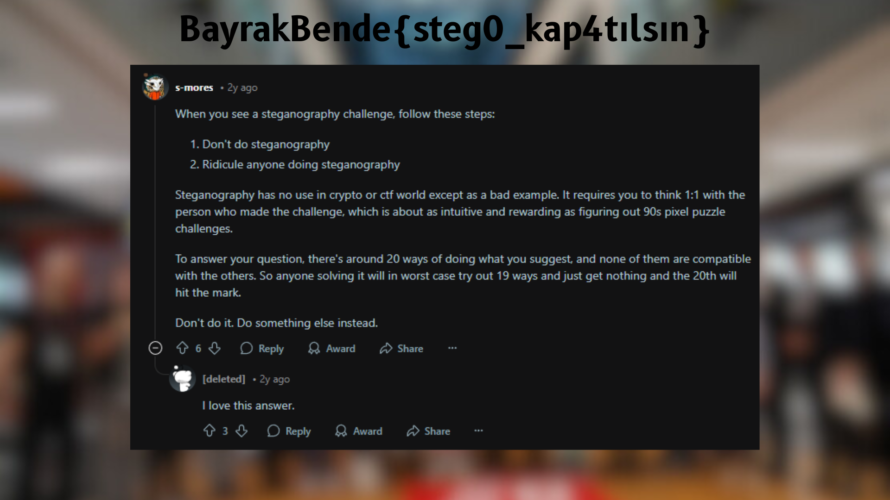

# Monitör

 |    |  |
 | ------------- |-------------|
 | Zorluk        | Zor (500 Puan)|
 | Aşama         | Yarı Final   |
 | Soru Türü     | Stego |
 | Dosya(lar)    | wallpaper.png |
 | Yazar(lar)    | [Ömer Faruk Sönmez](https://github.com/omertheroot) |

## Soru Metni

```
Yahu soruyu kaybetmemek için masaüstü arkaplanı yaptım, bilgisayar düştü disk yamuldu falan sorunun dosyası biraz bozuldu. Sana zahmet biraz kurcalar mısın? Bu arada monitörüm 1080p :)
```

## Çözüm

PNG dosyası hex editörle açılınca PNG struct'una göre eksik olan alanların doldurulması lazımdır. Silinen kısımlar dosya headeri, IHDR chunkundaki width ve height değerleridir.
Bu eğer ilk bakışta anlaşılamıyorsa https://medium.com/@0xwan/png-structure-for-beginner-8363ce2a9f73 bu linkteki gibi bir makaleden yardım alınabilir.
<br>


Header kısmı her PNG dosyası için sabit: ```89 50 4E 47 0D 0A 1A 0A```




Width ve heigh değerleri için ise monitörün 1080p olduğuna dair bir ipucumuz var. Yani buralara 1920 ve 1080'in hex karşılıklarını yazacağız. 
IHDR chunk headerinden hemen sonra gelen ilk 4 byte width değeri, sonraki 4 byte ise height değeri. Zaten ondan sonra chunk'un sonuna kadar değerler normal görünüyor.

İlk 4 byte'a yazmak için 1920'nin hex karşılığını hesaplıyoruz. (Big Endian olacak şekilde)
<br>

<br>
Aynı işlemi 1080 için de yapıyoruz.
<br>

<br>
Yani IHDR headerinden sonra boş kalan 8 byte'lık kısıma yazılacak olan değer bu olmuş oluyor: ```00 00 07 80 00 00 04 38```

Son hali bu şekilde görünmeli: <br>


Ve dosya düzeldi:



Bu şekilde bayrağa ulaşıyoruz.

## İpucu

```
1. PNG Struct'u araştırmanı öneririm
```

## Flag

```
BayrakBende{steg0_kap4tılsın}
```
