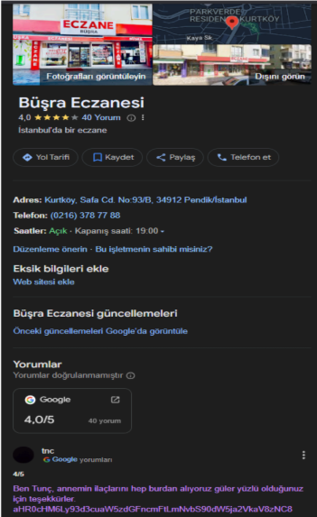
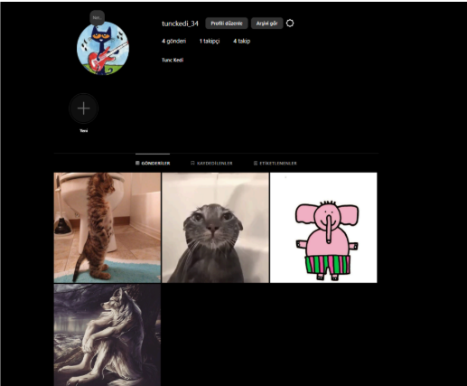
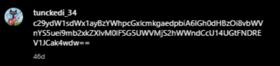
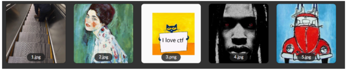

# Stoic
 |    |  |
 | ------------- |-------------|
 | Zorluk        | Kolay (200 Puan)|
 | Aşama         | Yarı Final   |
 | Soru Türü     | OSINT |
 | Yazar(lar)    | [İsmail Göktuğ İlgin](https://github.com/ilgoktu) |
## Soru Metni

```
“Tunç Kurtköyde yaşayan ve Türkiyenin ilk siber güvenlik lisesinde okuyan bir gençtir.
Okuldan eve döndüğü günlerden birinde annesi Büşra'nın evde hasta halde olduğunu
görünce ona nasıl yardımcı olabilceğini sorar.
Annesi Büşra ise evlerine yakın olan eczaneye gidip doktorun kendisi için yazdığı ilaçları
almasını ister.

Tunç da sorumluluk sahibi birisi olduğu için hemen gidip annesi Büşra için eczaneden ilaçları
getirir.”
```

## Çözüm

Öncelikle sorumuzun hikayesindeki ipuçlarından yola çıkarak Kurtköy Büşra Eczanesine
ulaşılması gerekiyor ve Büşra Eczanesinin internet yorumlarında görmemiz gereken başka
bir ipucu var.



Elde ettiğimiz ipucundaki kodu Base64 ile dönüştürürsek bize bir instagram hesabının linkini
veriyor. bu hesaptaki postların açıklamaları ise bize başka ipuçları veriyor ve sona doğru
yaklaştırıyor.





Bu görseldeki kod bizi bir mega.nz linkine götürecek diğer görseldeki kodları da Ascll ile
decode ettiğimizde bize “I love ctf” yazısını veriyor bu da mega dosyasının içinde birkaç farklı
klasöründe bulunuyor ancak baştaki hikayeden yola çıkarak dosyanın içindeki pendikliler
klasöründeki kedi fotoğrafına ulaşıyoruz.



Ortadaki görsel bizi çözümümüze bir adım daha yaklaştıran görsel. O görseli indirip şifreleme
tekniklerinden biri olan steganografi ile saklanmış mesajı buluyoruz. Ardından karşımıza
çıkan kodun hala şifreli olduğunu görüyoruz. Base64 decoder’ları sayesinde o şifreyi de son
haline dönüştürüp https://muhammedaliozdemir.com/ sitesine ulaşıyoruz. 

Sitenin kaynak kodlarından da flag'e ulaşıyoruz.

## Flag

```
BayrakBende{POLİNOM_NEFRETİ}
```
